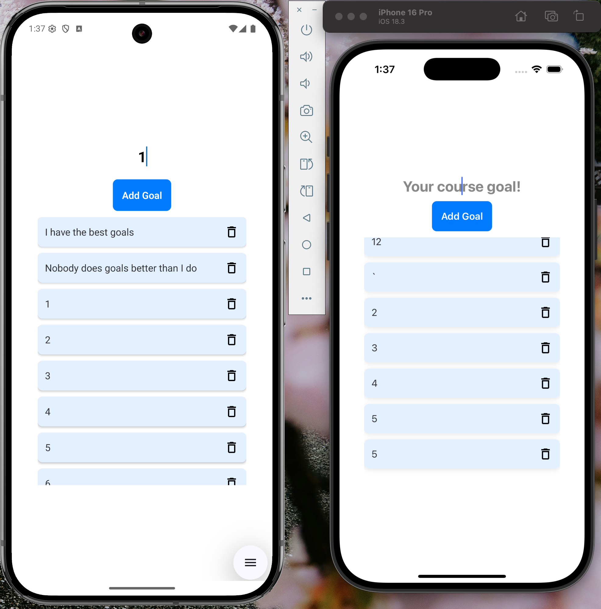
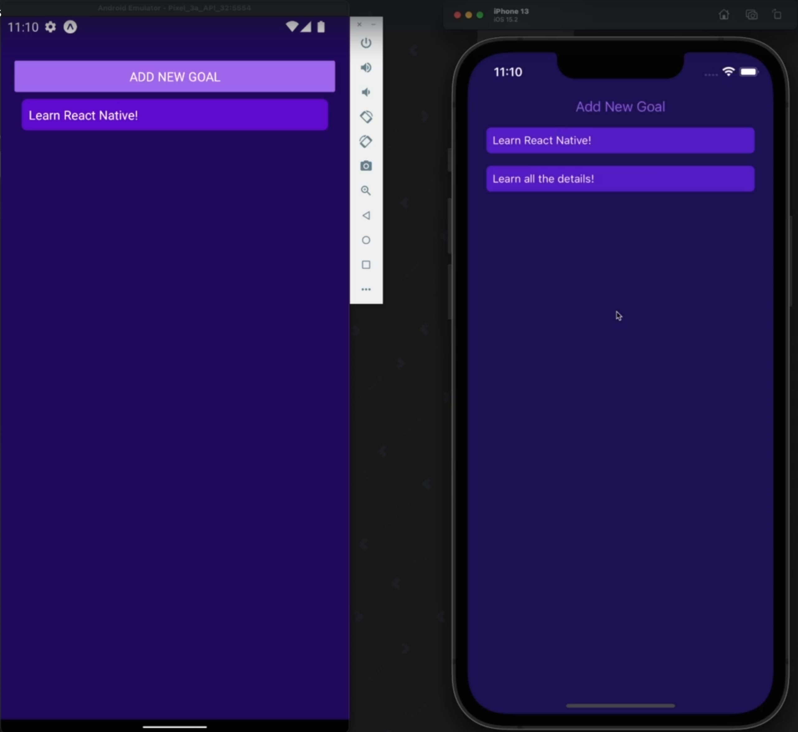

# Goals App - React Native

This project is based on the [React Native - The Practical Guide [2025]](https://www.udemy.com/course/react-native-the-practical-guide/) course, but implemented with TypeScript and modern best practices.

## 🚀 Features

- Modern UI with TypeScript implementation
- Goal tracking and management
- Smooth animations and transitions
- Cross-platform (iOS & Android) support
- Built with Expo Router for navigation

## 📱 Screenshots

### My Version (TypeScript)



### Course Version (JavaScript)



## 🛠️ Tech Stack

- **Framework**: React Native with Expo
- **Language**: TypeScript
- **Navigation**: Expo Router
- **UI Components**:
  - Expo Vector Icons
  - Expo Blur
  - Expo Image
- **Animations**:
  - React Native Reanimated
  - React Native Gesture Handler
- **State Management**: React Hooks
- **Development**:
  - ESLint
  - TypeScript
  - Expo Development Client

## 🏗️ Project Structure

```
goals-app/
├── app/                 # Main application code
├── assets/             # Images and static assets
├── .expo/              # Expo configuration
├── .vscode/            # VS Code settings
└── scripts/            # Utility scripts
```

## 🚀 Getting Started

1. **Prerequisites**

   - Node.js (LTS version)
   - npm or yarn
   - Expo CLI
   - iOS Simulator (for Mac) or Android Studio (for Android development)

2. **Installation**

   ```bash
   # Clone the repository
   git clone [repository-url]
   cd goals-app

   # Install dependencies
   npm install
   # or
   yarn install
   ```

3. **Running the App**

   ```bash
   # Start the development server
   npm start
   # or
   yarn start
   ```

   Then:

   - Press `i` to run on iOS simulator
   - Press `a` to run on Android emulator
   - Scan QR code with Expo Go app for physical device

## 📝 Available Scripts

- `npm start` - Start the Expo development server
- `npm run android` - Start the app on Android
- `npm run ios` - Start the app on iOS
- `npm run web` - Start the app in web browser
- `npm run lint` - Run ESLint
- `npm run reset-project` - Reset project to initial state

## 🔧 Configuration

The app uses the following configuration files:

- `app.json` - Expo configuration
- `tsconfig.json` - TypeScript configuration
- `eslint.config.js` - ESLint configuration
